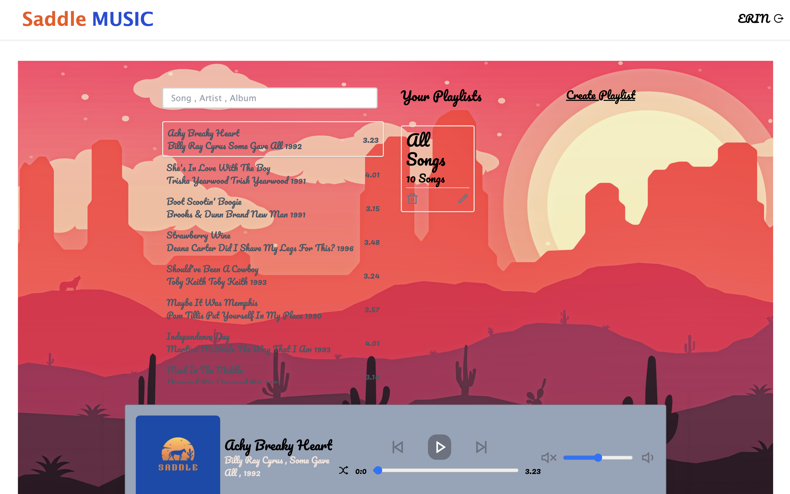

# SADDLE

## Description

Saddle is a full stack music player application that uses React, Express, Node, and Mongo along with Cloudinary and Multer to handle the media file uploads. This app is geared towards 90s country music fans who wants to create and save their own playlists using the Saddle music library. Saddle up and join the corral at the link below!

## Table of Contents

- [Team](#Team)
- [UserStory](#user-story)
- [Link](#Link)
- [Installation](#Installation)
- [License](#License)
- [Tests](#Tests)

## Team

- [Braxton Wilkey](https://github.com/cbw1981)
- [Erin Bresse](https://github.com/embresse)

## User Story

    AS A country music fan
    I WANT to create and listen to my own playlists that accesses a music library tailored to that genre
    SO THAT I can save my playlists to my personal page and access music that fits my interests and moods, which can be accessed at any time upon logging on.

## Link

[Link](https://saddle.herokuapp.com/)

## Installation

`npm i`

## License

MIT
Copyright 2023 jakeroth0

    Permission is hereby granted, free of charge, to any person obtaining a copy of this software and associated documentation files (the "Software"), to deal in the Software without restriction, including without limitation the rights to use, copy, modify, merge, publish, distribute, sublicense, and/or sell copies of the Software, and to permit persons to whom the Software is furnished to do so, subject to the following conditions:

    The above copyright notice and this permission notice shall be included in all copies or substantial portions of the Software.

    THE SOFTWARE IS PROVIDED "AS IS", WITHOUT WARRANTY OF ANY KIND, EXPRESS OR IMPLIED, INCLUDING BUT NOT LIMITED TO THE WARRANTIES OF MERCHANTABILITY, FITNESS FOR A PARTICULAR PURPOSE AND NONINFRINGEMENT. IN NO EVENT SHALL THE AUTHORS OR COPYRIGHT HOLDERS BE LIABLE FOR ANY CLAIM, DAMAGES OR OTHER LIABILITY, WHETHER IN AN ACTION OF CONTRACT, TORT OR OTHERWISE, ARISING FROM, OUT OF OR IN CONNECTION WITH THE SOFTWARE OR THE USE OR OTHER DEALINGS IN THE SOFTWARE.;

## Tests

To run tests, run the following command:

`npm test`

